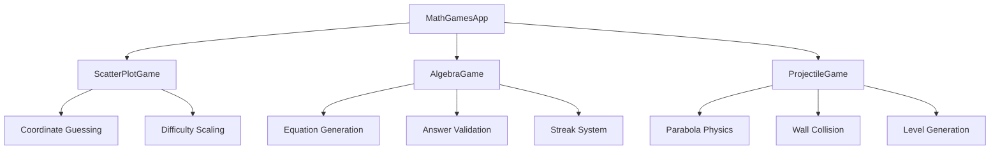

# 🎮 Three Math Games

<div align="center">


**Koleksi Game Matematika Interaktif - Project Pelatihan FreeCodeCamp**

[Fitur](#-fitur) • [Instalasi](#-instalasi) • [Penggunaan](#-penggunaan) • [Dokumentasi](#-dokumentasi)

</div>

## 📋 Daftar Isi

- [Gambaran Umum](#-gambaran-umum)
- [Fitur](#-fitur)
- [Instalasi](#-instalasi)
- [Penggunaan](#-penggunaan)
- [Dokumentasi](#-dokumentasi)
- [Contoh Penggunaan](#-contoh-penggunaan)
- [FAQ](#-faq)

## 🚀 Gambaran Umum

**Three Math Games** adalah aplikasi kumpulan game matematika interaktif yang dibangun dengan Python dan Tkinter. Aplikasi ini dikembangkan sebagai bagian dari pelatihan FreeCodeCamp dan menyediakan tiga jenis game matematika berbeda dalam satu antarmuka tab yang terorganisir, masing-masing dirancang untuk melatih keterampilan matematika dengan cara yang menyenangkan dan engaging.

### ✨ Highlights

- 🎯 **Tiga Game Berbeda** - Scatter plot, aljabar, dan fisika parabola
- 📊 **Visualisasi Interaktif** - Grafik matplotlib yang responsif
- 🧮 **Multiple Difficulty** - Level kesulitan yang dapat disesuaikan
- 🏆 **Sistem Skor** - Pelacakan progress dan akurasi
- 🎨 **GUI Professional** - Antarmuka tab dengan kontrol intuitif
- 🔄 **Real-time Feedback** - Umpan balik langsung untuk pembelajaran
- 🎓 **Educational Purpose** - Cocok untuk pembelajaran matematika yang menyenangkan

## 🌟 Fitur

### 🤖 Core Games
- **Scatter Plot Coordinate Game** - Tebak koordinat titik pada grafik
- **Algebra Practice Game** - Latihan menyelesaikan persamaan aljabar
- **Projectile Motion Game** - Atur parabola untuk melewati tembok

### 🛠️ Game Features
- **🎮 Scatter Plot Game** 
  - Tebak koordinat titik merah pada grid
  - Sistem penilaian dengan akurasi
  - Peningkatan kesulitan otomatis
  - Visualisasi titik bernomor

- **🧮 Algebra Game**
  - Persamaan satu-langkah dan dua-langkah
  - Tiga level kesulitan (Easy, Medium, Hard)
  - Sistem streak dan rekor
  - Generate problem acak

- **🎯 Projectile Game**
  - Dua mode: Basic (slider) dan Advanced (input)
  - Fisika parabola real-time
  - Wall obstacle dengan ketinggian acak
  - Visualisasi trajectory

### 💾 Progress Tracking
- **Real-time Scoring** - Skor update secara langsung
- **Accuracy Calculation** - Perhitungan akurasi persentase
- **Streak System** - Catatan jawaban benar beruntun
- **Attempt Tracking** - Statistik percobaan dan keberhasilan

### 🎨 GUI Features
- **Tabbed Interface** - Navigasi mudah antara game
- **Interactive Plots** - Grafik matplotlib yang dapat diinteraksi
- **Responsive Controls** - Slider, input fields, dan buttons
- **Professional Layout** - Spacing dan font yang konsisten
- **Visual Feedback** - Warna dan ikon untuk umpan balik

## 📥 Instalasi

### Prerequisites

- Python 3.7 atau lebih tinggi
- Libraries: matplotlib, numpy, tkinter

### Step-by-Step Installation

1. **Install Dependencies**
   ```bash
   pip install matplotlib numpy
   ```

2. **Download Script**
   ```bash
   # Save sebagai: math_games.py
   ```

3. **Verifikasi Dependencies**
   ```bash
   python -c "import matplotlib, numpy, tkinter; print('Dependencies OK')"
   ```

4. **Run Application**
   ```bash
   python math_games.py
   ```

### Quick Install
```bash
# Langsung jalankan file
python math_games.py
```

## 🎮 Penggunaan

### Menjalankan Aplikasi

```bash
python math_games.py
```

### Basic Navigation

1. **Pilih Game**
   - Klik tab "Scatter Plot Game", "Algebra Game", atau "Projectile Game"
   - Setiap game memiliki kontrol dan tujuan yang berbeda

2. **Scatter Plot Game**
   - Lihat titik-titik merah bernomor pada grafik
   - Pilih nomor titik dan tebak koordinat (x, y)
   - Klik "Guess" untuk memeriksa jawaban

3. **Algebra Game**
   - Klik "New Problem" untuk menghasilkan persamaan
   - Masukkan nilai x yang memenuhi persamaan
   - Klik "Check Answer" untuk verifikasi

4. **Projectile Game**
   - Pilih level Basic (slider) atau Advanced (input)
   - Atur koefisien parabola untuk melewati tembok
   - Klik "Check Solution" untuk menguji

### Game Controls

| Game | Primary Controls | Objective |
|------|------------------|-----------|
| **Scatter Plot** | Point selector, X/Y inputs | Tebak koordinat titik |
| **Algebra** | Answer input, difficulty selector | Selesaikan persamaan |
| **Projectile** | Sliders/coefficient inputs | Atur parabola melewati tembok |

### Difficulty Levels

**Algebra Game:**
- **Easy**: Persamaan sederhana, angka kecil
- **Medium**: Angka negatif, persamaan dua-langkah  
- **Hard**: Koefisien kompleks, angka besar

**Projectile Game:**
- **Basic**: Kontrol slider untuk koefisien
- **Advanced**: Input manual koefisien parabola

## 📚 Dokumentasi

### Architecture Overview



### Mathematical Concepts

**Scatter Plot Game:**
- Koordinat Cartesian (x, y)
- Grid navigation dan estimation
- Spatial reasoning

**Algebra Game:**
- Persamaan linear: ax + b = c
- Persamaan dua variabel: ax + b = cx + d
- Penyelesaian untuk x
- Operasi aljabar dasar

**Projectile Game:**
- Fungsi kuadrat: y = ax² + bx + c
- Fisika parabola dan trajectory
- Optimisasi koefisien
- Visualisasi matematika

## 💡 Contoh Penggunaan

### Contoh 1: Scatter Plot Game
```
🎮 Game: Tebak koordinat titik 3
📊 Titik terlihat di kuadran II

Input: 
Point: 3
X: -4
Y: 7

Hasil: ✅ Correct! The coordinates are (-4, 7)
Score: 3/4 | Accuracy: 75.0%
```

### Contoh 2: Algebra Game
```
🧮 Problem: Solve for x:
2x + 5 = 13

Input: x = 4

Hasil: ✅ Correct! x = 4
🔥 Hot streak! 3 correct in a row!
```

### Contoh 3: Projectile Game
```
🎯 Level: Basic Mode
Wall Position: x = 5.2
Wall Height: 3.8

Adjust sliders:
a = -0.3, b = 3.1, c = 2.0

Hasil: 🎉 SUCCESS! You cleared the wall!
At x = 5.2, your height was 4.1
Perfect! The projectile cleared by 0.3 units!
```

## ❓ FAQ

### Q: Apakah perlu install library tambahan?
**A:** Hanya matplotlib dan numpy. Tkinter sudah termasuk Python standard library.

### Q: Bagaimana cara meningkatkan kesulitan di Scatter Plot Game?
**A:** Klik "Increase Difficulty" untuk memperbesar grid dan menambah jumlah titik.

### Q: Apa perbedaan persamaan one-step dan two-step?
**A:** One-step: satu operasi untuk isolasi x. Two-step: dua operasi diperlukan.

### Q: Bagaimana Projectile Game menghitung kesuksesan?
**A:** Game memeriksa jika tinggi parabola di posisi tembok > tinggi tembok.

### Q: Bisakah menyimpan progress game?
**A:** Belum tersedia di versi ini, tapi statistik tersimpan selama sesi berjalan.

### Q: Apa gunanya streak system di Algebra Game?
**A:** Memotivasi pemain dengan mencatat jawaban benar beruntun dan memberi feedback spesial.

### Q: Bagaimana cara terbaik belajar dengan game ini?
**A:** Mulai dari difficulty rendah, perhatikan feedback, dan naik level secara bertahap.

### Q: Apakah cocok untuk semua usia?
**A:** Ya, dari pelajar SMP sampai dewasa yang ingin menyegarkan matematika dasar.

---

<div align="center">

*"Mathematics is not about numbers, equations, computations, or algorithms: it is about understanding." - William Paul Thurston*


**⭐ Jika project ini membantu, beri bintang di repository! ⭐**

</div>