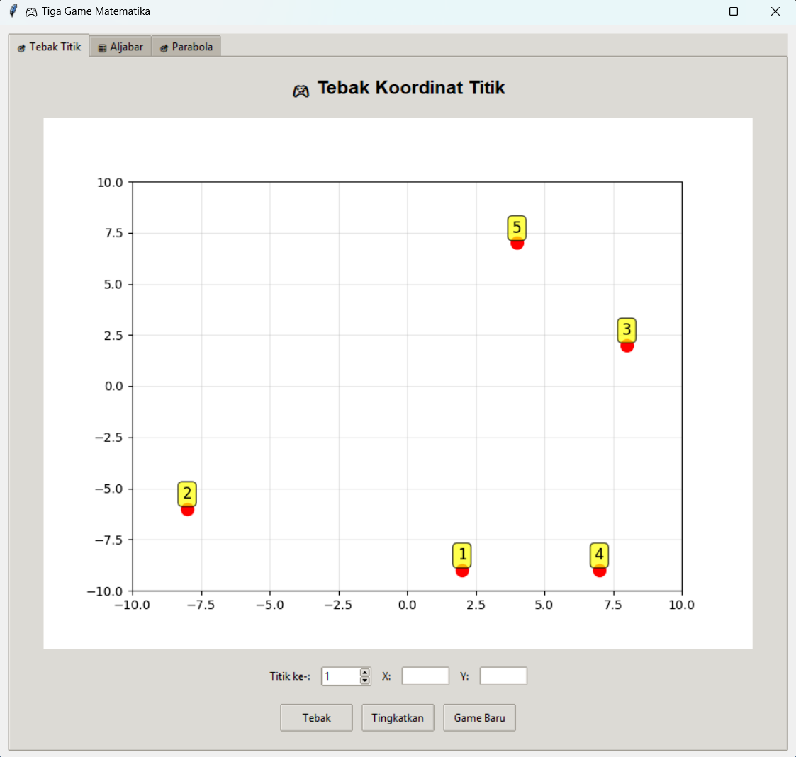
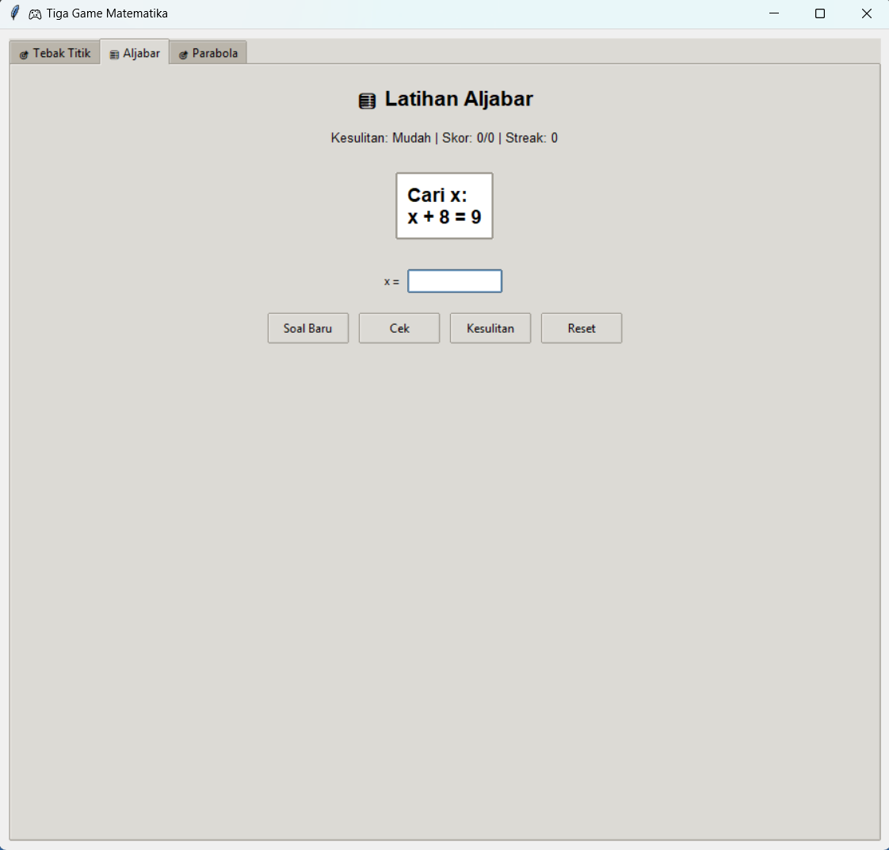
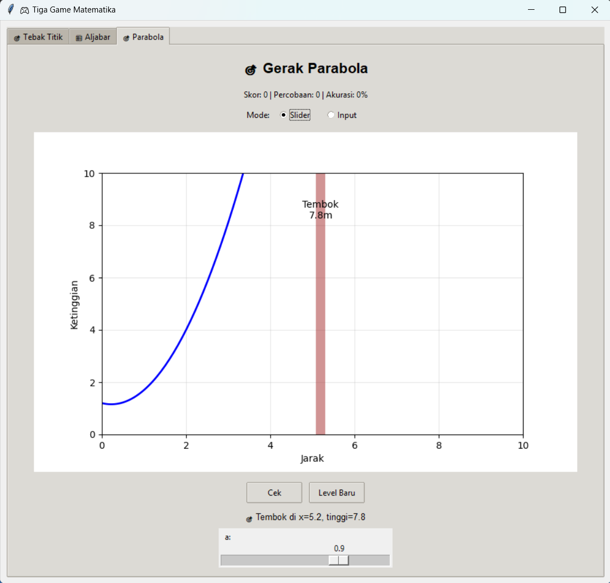
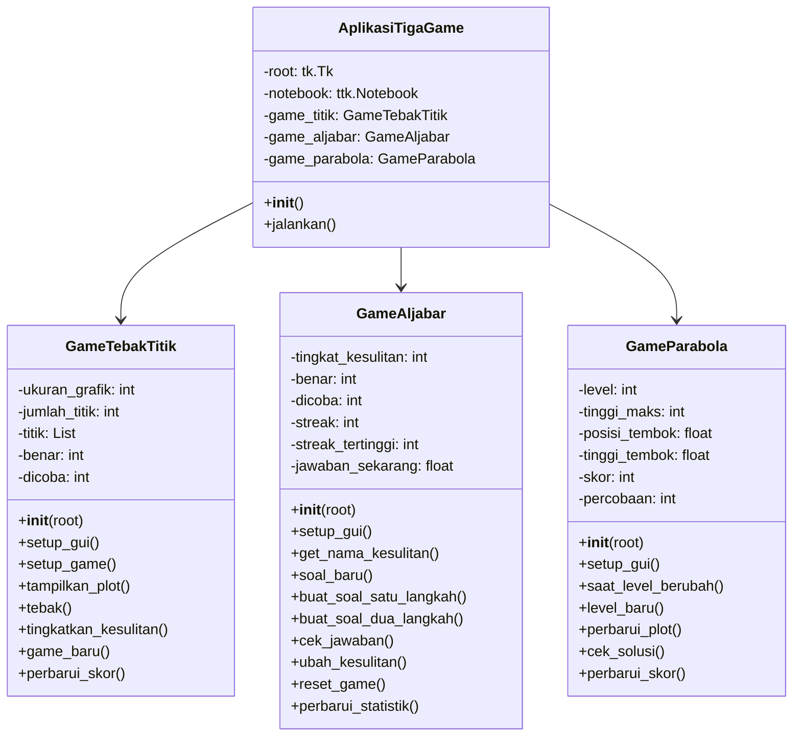
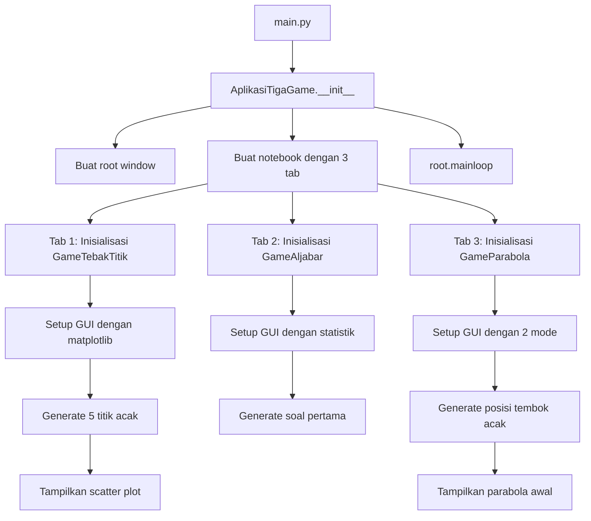
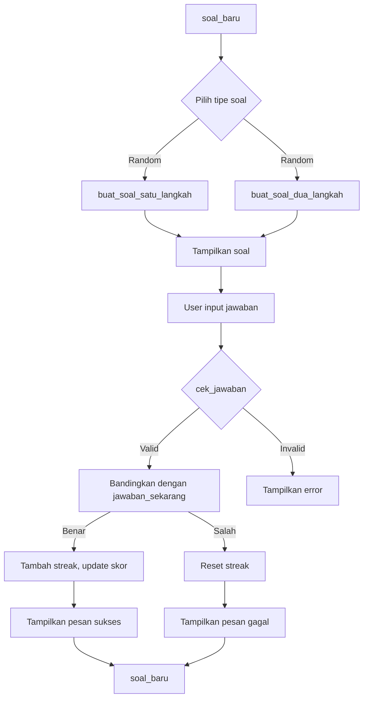
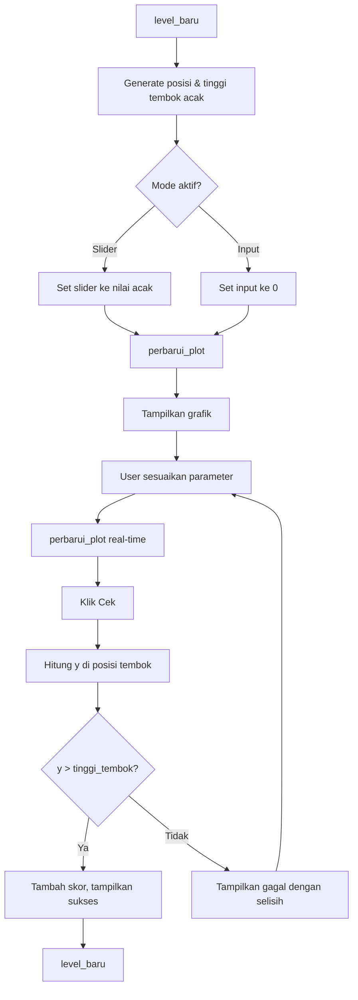
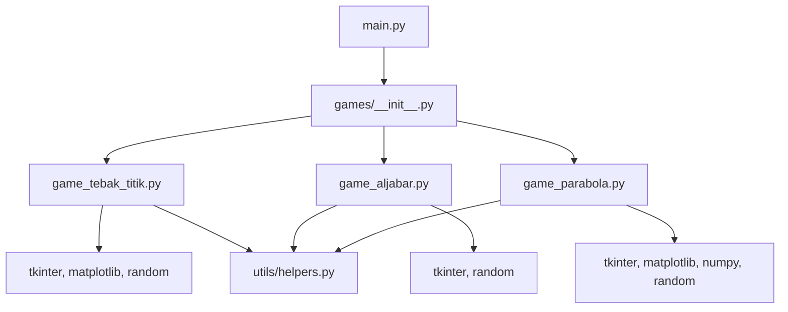

# 🎮 Tiga Game Matematika

<div align="center">


[](https://www.freecodecamp.org/certification/chrisimana/college-algebra-with-python-v8)


**Koleksi tiga game matematika interaktif untuk pembelajaran yang menyenangkan**

</div>

## 📋 Deskripsi Proyek

**Tiga Game Matematika** adalah aplikasi berbasis GUI yang dikembangkan sebagai bagian dari persyaratan untuk mendapatkan sertifikat dari FreeCodeCamp. Aplikasi ini menggabungkan tiga permainan matematika interaktif dalam satu antarmuka yang menarik, dirancang untuk membuat pembelajaran matematika menjadi lebih menyenangkan dan engaging.

Ketiga game yang tersedia:
1. **🎯 Game Tebak Titik** - Melatih kemampuan membaca koordinat kartesian
2. **🧮 Game Aljabar** - Melatih kemampuan menyelesaikan persamaan linear
3. **🎯 Game Gerak Parabola** - Memvisualisasikan dan memahami fungsi kuadrat

Tujuan utama proyek ini adalah menciptakan alat pembelajaran matematika yang interaktif dan menyenangkan, membantu pengguna (terutama pelajar) untuk memahami konsep-konsep matematika melalui pendekatan gamifikasi. Aplikasi ini menjawab kebutuhan akan media pembelajaran yang:
- **Interaktif** - Pengguna dapat berinteraksi langsung dengan konsep matematika
- **Visual** - Konsep abstrak divisualisasikan dengan grafik
- **Adaptif** - Tingkat kesulitan dapat disesuaikan dengan kemampuan pengguna
- **Memotivasi** - Sistem skor dan streak mendorong pengguna untuk terus belajar

## 📑 Daftar Isi

- [Deskripsi Proyek](#-deskripsi-proyek)
- [Demo](#-demo)
- [Tampilan Aplikasi](#-tampilan-aplikasi)
- [Latar Belakang](#-latar-belakang)
- [Fitur Utama](#-fitur-utama)
- [Teknologi yang Digunakan](#-teknologi-yang-digunakan)
- [Arsitektur](#-arsitektur)
- [Struktur Proyek](#-struktur-proyek)
- [Cara Instalasi](#-cara-instalasi)
- [Cara Penggunaan](#-cara-penggunaan)
- [Peran Developer](#-peran-developer)
- [Pembelajaran dari Proyek](#-pembelajaran-dari-proyek-lessons-learned)
- [Ucapan Terima Kasih](#-ucapan-terima-kasih)

## 🎮 Demo

(Coming Soon
)
## 📸 Tampilan Aplikasi


### Game Tebak Titik




### Game Aljabar




### Game Gerak Parabola




## 🎯 Latar Belakang

Proyek ini dibuat sebagai bagian dari perjalanan pembelajaran saya di FreeCodeCamp untuk memenuhi persyaratan sertifikat. Latar belakang pembuatan proyek ini meliputi:

- **Menerapkan konsep yang dipelajari** - Mempraktikkan penggunaan matplotlib, numpy, tkinter, dan pemrograman berorientasi objek
- **Membuat alat pembelajaran yang menyenangkan** - Menggabungkan edukasi dan hiburan (edutainment) untuk membuat matematika lebih menarik
- **Memvisualisasikan konsep abstrak** - Membantu pemahaman konsep koordinat kartesian, aljabar, dan fungsi kuadrat melalui visualisasi interaktif


## 🌟 Fitur Utama

### 📁 **Struktur Modular**
- **Organisasi kode terpisah** - Setiap game dalam file sendiri (`game_tebak_titik.py`, `game_aljabar.py`, `game_parabola.py`)
- **Package structure** - Menggunakan package `games` dan `utils` untuk organisasi yang rapi
- **Helper functions** - Fungsi pembantu dalam `helpers.py` untuk reuse kode

### 🎯 **Game 1: Tebak Titik**

| Fitur | Deskripsi |
|-------|-----------|
| **Visualisasi Scatter Plot** | Menampilkan 5 titik acak dalam rentang ±10 |
| **Penomoran Titik** | Setiap titik diberi nomor untuk identifikasi mudah |
| **Input Koordinat** | Pemain memasukkan tebakan koordinat X dan Y |
| **Validasi Otomatis** | Sistem memeriksa kebenaran tebakan dengan toleransi 0.1 |
| **Sistem Skor** | Melacak jumlah tebakan benar dan total percobaan |
| **Akurasi Real-time** | Menampilkan persentase akurasi pemain |
| **Tingkat Kesulitan Progresif** | Tombol "Tingkatkan" memperluas rentang dan menambah titik (maks 8) |
| **Game Baru** | Mereset permainan dengan titik-titik baru |

### 🧮 **Game 2: Aljabar**

| Fitur | Deskripsi |
|-------|-----------|
| **Soal Acak** | Menghasilkan soal persamaan linear secara acak |
| **Tiga Tingkat Kesulitan** | Mudah, Sedang, dan Sulit dengan karakteristik berbeda |
| **Dua Tipe Soal** | Persamaan satu langkah dan dua langkah |
| **Sistem Streak** | Melacak jawaban benar beruntun dengan pesan spesial "🔥 Streak 3!" |
| **Streak Tertinggi** | Mencatat rekor streak terbaik |
| **Umpan Balik Instan** | Memberi tahu jawaban benar/salah beserta solusi |
| **Statistik Lengkap** | Menampilkan skor, streak, dan akurasi |
| **Enter Key Support** | Bisa tekan Enter untuk submit jawaban |

#### Tingkat Kesulitan Aljabar

| Level | Karakteristik | Rentang Angka |
|-------|---------------|---------------|
| **Mudah** | Koefisien sederhana, a=1 | -10 s/d 10 |
| **Sedang** | Koefisien variasi (-1,1,2,-2) | -20 s/d 20 |
| **Sulit** | Koefisien kompleks, a≠c | -50 s/d 50 |

### 📈 **Game 3: Gerak Parabola**

| Fitur | Deskripsi |
|-------|-----------|
| **Visualisasi Interaktif** | Grafik parabola real-time dengan matplotlib |
| **Dua Mode Input** | Slider (Dasar) dan Input Teks (Lanjutan) |
| **Tembok Acak** | Posisi (x=3-7) dan tinggi (2-8) tembok dihasilkan acak |
| **Visual Feedback** | Warna titik: Hijau (berhasil), Merah (gagal) |
| **Teks Informasi** | Menampilkan posisi dan tinggi tembok |
| **Tips Otomatis** | Menampilkan selisih jika gagal |
| **Sistem Skor** | Menghitung keberhasilan melewati tembok |
| **Level Progresif** | Level baru otomatis setelah berhasil |

#### Mode Permainan Parabola

| Mode | Kontrol | Cocok untuk |
|------|---------|-------------|
| **Slider** | Slider untuk a (-2..2), b (-5..5), c (0..10) | Pemula, eksplorasi visual |
| **Input** | Input teks langsung untuk a, b, c | Pengguna yang sudah paham konsep |

### 🎨 **Fitur UI/UX**
- **Antarmuka Tab** - Navigasi mudah antar tiga game dengan `ttk.Notebook`
- **Tema Modern** - Menggunakan `clam` theme untuk tampilan yang lebih baik
- **Responsive Layout** - Elemen GUI menyesuaikan dengan `pack()` dan `grid()`
- **Shortcut Keyboard** - Enter untuk submit jawaban di Game Aljabar
- **Error Handling** - Validasi input dan pesan error dengan `messagebox`

## 🛠️ Teknologi yang Digunakan

### Core Technologies (Sesuai Kurikulum FreeCodeCamp)

| Teknologi | Fungsi | Alasan Penggunaan |
|-----------|--------|-------------------|
| **Python 3.7+** | Bahasa pemrograman utama | Bahasa utama kurikulum FreeCodeCamp |
| **Tkinter** | GUI framework | Library GUI bawaan Python, mudah dipelajari |
| **Matplotlib** | Visualisasi grafik | Library visualisasi paling populer untuk Python |
| **NumPy** | Komputasi numerik | Membuat array untuk plotting parabola |
| **Random** | Generate angka acak | Membuat soal dan posisi acak |

### Library Pendukung

| Library | Fungsi | Digunakan di |
|---------|--------|--------------|
| **tkinter.ttk** | Widget tematik modern | Semua game |
| **matplotlib.backends.backend_tkagg** | Integrasi matplotlib dengan tkinter | Game Titik & Parabola |
| **numpy** | Array dan operasi matematika | Game Parabola |
| **random** | Generate angka acak | Semua game |

## 🏗️ Arsitektur

### Diagram Kelas



### Alur Kerja Aplikasi



### Alur Game Aljabar



### Alur Game Parabola



## 📁 Struktur Proyek

```
tiga-game-matematika/
│
├── games/
│   ├── __init__.py
│   ├── game_tebak_titik.py
│   ├── game_aljabar.py
│   └── game_parabola.py
│
├── utils/
│   ├── __init__.py
│   └── helpers.py
│
├── main.py 
├── README.md                      
└── LICENSE.md                    
```

### Penjelasan File

| File | Fungsi untuk FreeCodeCamp |
|------|--------------------------|
| **main.py** | Entry point aplikasi yang menginisialisasi `AplikasiTigaGame` dan menjalankan GUI. |
| **games/__init__.py** | Mengekspor class game agar bisa diimpor dengan `from games import GameTebakTitik, GameAljabar, GameParabola`. |
| **games/game_tebak_titik.py** | Berisi class `GameTebakTitik` dengan semua logika dan GUI untuk game tebak koordinat. |
| **games/game_aljabar.py** | Berisi class `GameAljabar` dengan semua logika dan GUI untuk game latihan aljabar. |
| **games/game_parabola.py** | Berisi class `GameParabola` dengan semua logika dan GUI untuk game gerak parabola. |
| **utils/helpers.py** | Berisi fungsi-fungsi pembantu yang digunakan di beberapa game untuk menghindari duplikasi kode. |

### Dependency Graph



## 📥 Cara Instalasi

### Prasyarat (FreeCodeCamp Environment)

- **Python 3.7 atau lebih tinggi** - [Download Python](https://www.python.org/downloads/)
- **Pip** - Python package installer (biasanya sudah termasuk)
- **Koneksi Internet** - Untuk mengunduh dependencies

### Langkah-langkah Instalasi

1. **Clone Repository**
   ```bash
   git clone https://github.com/Chrisimana/tiga-game-matematika
   cd tiga-game-matematika
   ```

2. **Buat Virtual Environment (Disarankan)**
   ```bash
   # Windows
   python -m venv venv
   venv\Scripts\activate
   
   # Linux/Mac
   python3 -m venv venv
   source venv/bin/activate
   ```

3. **Install Dependencies**
   ```bash
   pip install matplotlib numpy
   ```

4. **Jalankan Aplikasi**
   ```bash
   python src/main.py
   ```


### Verifikasi Instalasi

Untuk memastikan semua library terinstal dengan benar:
```bash
python -c "import matplotlib, numpy, tkinter; print('✅ Semua library siap!')"
```

## 🎮 Cara Penggunaan

### Menjalankan Aplikasi

```bash
python src/main.py
```

### Navigasi Antar Game

Aplikasi ini memiliki 3 tab yang dapat dipilih dengan mengklik tab tersebut:

| Tab | Game | Icon | Tujuan Pembelajaran |
|-----|------|------|---------------------|
| **🎯 Tebak Titik** | Tebak koordinat titik | 🎯 | Membaca koordinat kartesian |
| **🧮 Aljabar** | Latihan persamaan linear | 🧮 | Menyelesaikan persamaan |
| **🎯 Parabola** | Gerak parabola | 📈 | Memahami fungsi kuadrat |

---

### 🎯 **Game 1: Tebak Titik**

#### Cara Bermain
1. **Amati Grafik** - Lihat 5 titik bernomor 1-5 pada scatter plot
2. **Pilih Nomor Titik** - Gunakan spinbox untuk memilih nomor titik (1-5)
3. **Tebak Koordinat** - Masukkan tebakan koordinat X dan Y
4. **Klik "Tebak"** - Sistem akan mengecek kebenaran tebakan
5. **Lihat Hasil** - Dapatkan feedback benar/salah dengan koordinat yang benar

#### Tips Bermain
- Perhatikan skala sumbu X dan Y (rentang ±10)
- Titik diberi nomor untuk memudahkan identifikasi
- Gunakan grid untuk membantu estimasi koordinat
- Klik "Tingkatkan" untuk tantangan lebih besar

#### Kontrol Game
| Tombol | Fungsi |
|--------|--------|
| **Tebak** | Mengecek tebakan koordinat |
| **Tingkatkan** | Memperluas rentang (+5) dan menambah titik (+1) |
| **Game Baru** | Mereset permainan dengan titik-titik baru |

---

### 🧮 **Game 2: Aljabar**

#### Cara Bermain
1. **Soal Otomatis** - Setiap membuka tab, soal langsung muncul
2. **Baca Soal** - Persamaan ditampilkan, misal: `2x + 5 = 11`
3. **Hitung Jawaban** - Cari nilai x yang memenuhi persamaan
4. **Masukkan Jawaban** - Ketik jawaban di kolom input "x ="
5. **Klik "Cek"** (atau tekan Enter)
6. **Dapatkan Feedback** - Lihat apakah jawaban benar/salah
7. **Soal Baru Otomatis** - Setelah cek, soal baru langsung muncul

#### Tips Bermain
- Mulai dari tingkat kesulitan Mudah
- Perhatikan tanda positif/negatif
- Streak 3+ akan mendapat pesan "🔥 Streak 3!"
- Gunakan "Kesulitan" untuk tantangan lebih besar
- "Reset" untuk memulai dari awal

#### Tingkat Kesulitan
| Level | Deskripsi | Contoh Soal |
|-------|-----------|-------------|
| **Mudah** | Persamaan satu langkah, a=1 | `x + 5 = 10` |
| **Sedang** | Koefisien bervariasi, bisa negatif | `-2x + 7 = 15` |
| **Sulit** | Dua langkah dengan koefisien kompleks | `3x - 8 = 2x + 12` |

#### Kontrol Game
| Tombol | Fungsi |
|--------|--------|
| **Soal Baru** | Menghasilkan soal baru secara manual |
| **Cek** | Memeriksa jawaban (bisa tekan Enter) |
| **Kesulitan** | Mengubah tingkat kesulitan (Mudah/Sedang/Sulit) |
| **Reset** | Mereset semua statistik (skor, streak) |

---

### 📈 **Game 3: Gerak Parabola**

#### Cara Bermain
1. **Pilih Mode** - Slider (Dasar) atau Input (Lanjutan)
2. **Mode Slider**:
   - Geser slider a, b, c untuk mengubah bentuk parabola
   - Lihat perubahan grafik secara real-time
3. **Mode Input**:
   - Masukkan nilai a, b, c langsung di kotak input
   - Grafik akan update otomatis
4. **Target** - Sesuaikan parabola agar **melewati atas tembok**
   - Tembok digambarkan sebagai garis vertikal coklat
   - Tinggi tembok ditampilkan di atas tembok
5. **Klik "Cek"** untuk mengecek
6. **Berhasil** - Jika melewati tembok, skor bertambah dan level baru muncul
7. **Gagal** - Akan ditampilkan selisih ketinggian yang kurang

#### Tips Bermain
- **Mode Slider**: Cocok untuk eksplorasi dan pemula
- **Mode Input**: Untuk latihan presisi dan pemahaman koefisien
- Perhatikan posisi tembok (x) dan tinggi yang dibutuhkan
- Warna titik di tembok: Hijau (berhasil), Merah (gagal)
- Setelah berhasil, level baru otomatis dengan tembok berbeda

#### Parameter Parabola (y = ax² + bx + c)
| Koefisien | Rentang | Pengaruh | Tips |
|-----------|---------|----------|------|
| **a** | -2 s/d 2 | Kelengkungan parabola | Positif = buka ke atas, Negatif = buka ke bawah |
| **b** | -5 s/d 5 | Kemiringan/kemiringan | Mempengaruhi posisi puncak secara horizontal |
| **c** | 0 s/d 10 | Tinggi awal | Nilai y saat x=0 (titik awal) |

#### Kontrol Game
| Tombol | Fungsi |
|--------|--------|
| **Cek** | Mengecek apakah parabola melewati tembok |
| **Level Baru** | Menghasilkan posisi dan tinggi tembok baru |

---

### Shortcut dan Tips Umum

| Shortcut | Fungsi | Game |
|----------|--------|------|
| **Enter** | Submit jawaban | Game Aljabar |
| **Tab** | Navigasi antar field input | Semua game |
| **Alt + F4** | Menutup aplikasi | Semua game |

## 👨‍💻 Peran Developer

### Peran dalam Proyek

| Area | Kontribusi | Konsep FreeCodeCamp yang Diterapkan |
|------|------------|-------------------------------------|
| **Perencanaan** | Merancang 3 game dengan tujuan pembelajaran berbeda | Problem decomposition, algorithm design |
| **Arsitektur** | Mendesain struktur package modular (games/, utils/) | Software architecture, modular programming |
| **GUI Development** | Membangun antarmuka dengan Tkinter dan ttk | GUI programming, event handling |
| **Visualization** | Integrasi matplotlib untuk grafik interaktif | Data visualization, plotting |
| **Game Logic** | Implementasi aturan main dan sistem skor | Control flow, conditional logic |
| **Random Generation** | Membuat soal dan posisi acak | Random module, probability |
| **Error Handling** | Validasi input dan exception handling | Try-except blocks, debugging |
| **OOP Design** | Struktur kelas dengan inheritance dan composition | Object-oriented programming |
| **Code Reuse** | Membuat helper functions di utils/helpers.py | DRY principle, modularity |

### Kompetensi

#### 1. **Python Fundamentals**
- Variables dan data types (int, float, string, list)
- Control flow (if-else, loops, while)
- Functions dan methods dengan parameter
- List comprehension untuk membuat titik
- Dictionary untuk mapping tingkat kesulitan

#### 2. **Object-Oriented Programming**
- Class definition dengan `__init__`
- Instance variables dan methods
- Encapsulation dengan private attributes (konvensi _)
- Class composition (AplikasiTigaGame mengandung 3 game)
- Import antar module dengan package structure

#### 3. **GUI Programming dengan Tkinter**
- Window management (`Tk()`, `mainloop()`)
- Widget creation (Frame, Label, Button, Entry, Spinbox, Scale)
- Event binding (`command`, `bind`, `trace`)
- Layout management (`pack()`, `grid()`)
- Dialog boxes (`messagebox`, `Toplevel`)
- Theme styling dengan `ttk.Style().theme_use()`

#### 4. **Scientific Computing**
- NumPy arrays untuk plotting parabola
- Mathematical operations (random, power, abs)
- Floating point precision handling dengan toleransi 0.01-0.1
- Random number generation untuk variasi soal

#### 5. **Data Visualization dengan Matplotlib**
- Figure and axes management
- Scatter plots untuk titik-titik
- Line plots untuk parabola
- Customizing plots (labels, titles, grids, colors)
- Integration with Tkinter (`FigureCanvasTkAgg`)
- Dynamic updating dengan `canvas.draw()`

#### 6. **Modular Programming**
- Package structure dengan `__init__.py`
- Separasi concerns (setiap game dalam file sendiri)
- Helper functions untuk reuse kode
- Relative imports antar module

#### 7. **Error Handling**
- Try-except blocks untuk validasi input numerik
- Custom error messages dengan messagebox
- Edge case handling (division by zero, empty input)
- Validation sebelum eksekusi

## 📚 Pembelajaran dari Proyek (Lessons Learned)

### Technical Skills yang Diperoleh

#### 1. **Python Programming Deep Dive**
```python
# Sebelum proyek: Hanya tahu basic syntax
# Sesudah proyek: Memahami konsep lanjutan

# Package structure dengan __init__.py
from games import GameTebakTitik, GameAljabar, GameParabola

# Class composition
class AplikasiTigaGame:
    def __init__(self):
        self.game_titik = GameTebakTitik(self.bingkai_titik)
        self.game_aljabar = GameAljabar(self.bingkai_aljabar)
        self.game_parabola = GameParabola(self.bingkai_parabola)

# Event-driven programming dengan callback
self.slider_a.configure(command=self.perbarui_plot)
self.var_a.trace('w', lambda *_: self.perbarui_plot())
entry.bind('<Return>', lambda e: self.cek_jawaban())

# Helper functions untuk reuse
from utils.helpers import format_angka, acak_dalam_rentang
```

#### 2. **Tkinter Mastery**
```python
# Mempelajari berbagai widget tkinter:
- ttk.Frame, ttk.Label, ttk.Button  # Widget dasar
- ttk.Entry, ttk.Spinbox             # Input widgets
- tk.Scale                            # Slider untuk input nilai
- ttk.Radiobutton                     # Pilihan mode
- ttk.Notebook                        # Tab management
- tk.Toplevel                         # Dialog popup

# Layout management dengan pack() dan grid()
widget.pack(side='left', padx=5, pady=10, fill='both', expand=True)
widget.grid(row=0, column=0, padx=5, pady=5)

# Theme styling
style = ttk.Style()
style.theme_use('clam')  # Tema modern
```

#### 3. **Matplotlib Integration**
```python
# Integrasi matplotlib dengan tkinter
from matplotlib.backends.backend_tkagg import FigureCanvasTkAgg

self.fig = Figure(figsize=(8, 6))
self.ax = self.fig.add_subplot(111)
self.canvas = FigureCanvasTkAgg(self.fig, self.bingkai_utama)

# Dynamic plotting dengan update real-time
def perbarui_plot(self, event=None):
    self.ax.clear()
    # ... plotting code ...
    self.canvas.draw()  # Render ulang

# Event-driven plotting dengan trace
self.var_a.trace('w', lambda *_: self.perbarui_plot())
```

#### 4. **Game Logic Implementation**
```python
# Aljabar: Generate soal dengan tingkat kesulitan
def buat_soal_satu_langkah(self):
    if self.tingkat_kesulitan == 1:
        a = 1  # Koefisien sederhana
        b = random.randint(-10, 10)
        c = random.randint(-10, 10)
    elif self.tingkat_kesulitan == 2:
        a = random.choice([1, -1, 2, -2])  # Variasi
        b = random.randint(-20, 20)
        c = random.randint(-20, 20)
    else:  # Sulit
        a = random.randint(-5, 5) or 1  # Hindari 0
        b = random.randint(-50, 50)
        c = random.randint(-50, 50)

# Parabola: Cek solusi dengan toleransi
y_tembok = a * self.posisi_tembok**2 + b * self.posisi_tembok + c
if y_tembok > self.tinggi_tembok:  # Berhasil jika melewati
    self.skor += 1
    self.level_baru()
else:
    selisih = self.tinggi_tembok - y_tembok  # Hitung kekurangan

# Streak system dengan feedback motivasi
if self.streak >= 3:
    pesan += f"\n🔥 Streak {self.streak}!"
```

#### 5. **Modular Design Patterns**
```python
# games/__init__.py - Ekspor class
from .game_tebak_titik import GameTebakTitik
from .game_aljabar import GameAljabar
from .game_parabola import GameParabola

# utils/helpers.py - Fungsi reuse
def format_angka(angka, desimal=2):
    return f"{angka:.{desimal}f}"

def acak_dalam_rentang(min_val, max_val, desimal=2):
    return round(random.uniform(min_val, max_val), desimal)

# main.py - Entry point dengan import bersih
from games import GameTebakTitik, GameAljabar, GameParabola
from utils.helpers import format_angka
```

### Soft Skills yang Dikembangkan

#### 1. **Problem Decomposition**
- Memecah aplikasi besar menjadi 3 game terpisah
- Setiap game memiliki file sendiri dengan tanggung jawab spesifik
- Fitur dipecah menjadi method-method kecil yang fokus
- Memisahkan utilitas ke package terpisah

#### 2. **User-Centered Design**
- Memikirkan pengguna akhir (pelajar matematika)
- Menyediakan dua mode untuk berbagai tingkat kemampuan
- Memberikan feedback yang informatif dan memotivasi
- Menambahkan streak system untuk meningkatkan engagement
- Visual feedback dengan warna (hijau/merah)

#### 3. **Code Organization**
- Struktur package yang rapi (games/, utils/)
- Naming convention yang konsisten (Indonesia untuk UI, Inggris untuk kode)
- Dokumentasi dengan komentar untuk bagian kompleks
- DRY principle dengan helper functions

#### 4. **Testing and Debugging**
- Menguji dengan berbagai input (valid dan invalid)
- Mengidentifikasi edge cases (pembagian nol, input kosong)
- Menambahkan error handling di setiap interaksi user
- Validasi input sebelum diproses


## 🙏 Ucapan Terima Kasih

### FreeCodeCamp
Terima kasih yang sebesar-besarnya kepada **FreeCodeCamp** atas:
- **Kurikulum gratis berkualitas tinggi** yang memungkinkan siapa pun belajar coding
- **Proyek-proyek tantangan** yang mendorong penerapan praktis
- **Komunitas global** yang saling mendukung dalam perjalanan belajar
- **Sertifikat** yang diakui dan memotivasi untuk terus belajar


### Sumber Daya dan Referensi

#### Dokumentasi Resmi
- [Python Documentation](https://docs.python.org/3/) - Referensi utama untuk semua fitur Python
- [Tkinter Documentation](https://docs.python.org/3/library/tkinter.html) - Untuk GUI development
- [Matplotlib Documentation](https://matplotlib.org/stable/contents.html) - Untuk visualisasi grafik
- [NumPy Documentation](https://numpy.org/doc/stable/) - Untuk komputasi numerik

### Tools yang Membantu
- **GitHub** - Hosting repository dan version control
- **Visual Studio Code** - Editor kode dengan fitur luar biasa
- **Shields.io** - Untuk membuat badges yang keren di README
- **Mermaid.js** - Untuk membuat diagram alur yang interaktif

---

<div align="center">

**⭐ Jika proyek ini membantu perjalanan belajar Anda di FreeCodeCamp atau membantu pembelajaran matematika, jangan lupa berikan bintang! ⭐**

**"Belajar matematika tidak harus membosankan dengan gamifikasi, siapa pun bisa menikmatinya!"**

</div>